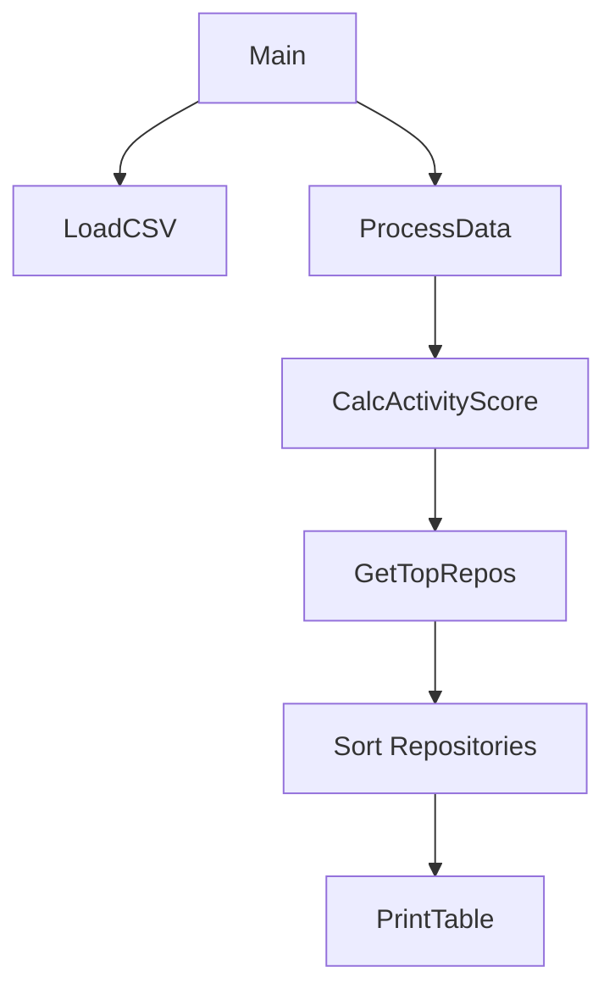

# 🏆 Activity Ranking

## Approach
The approach for reading and processing the file involved implementing a Go routine that reads and processes the data concurrently, using the functions provided as inputs.
To calculate the score for each repository, a weight was assigned to the relevant fields.

```domain/score.go```
```go
const (
    wCommit = 1.0  // weight for commits
    wFiles  = 2.0  // weight for files changed
    wAdds   = 0.5  // weight for additions
    wDels   = 0.5  // weight for deletions
)
```

## Running

* **How to Test**
```bash
$ make tests
```

* **How to Run**
```bash
$ make run path=data/commits.csv
```


## Diagram
The following diagram illustrates the workflow of the program, from loading the data to processing and sorting the repositories



## Built With

+ golang 1.24.1

## About

This repository activity ranking system is designed to process GitHub repository data and generate a score based on activity metrics such as commits, files changed, additions, and deletions. The system reads a CSV file containing commit data, processes it concurrently, calculates scores for each repository, and then returns the top repositories based on their activity.

